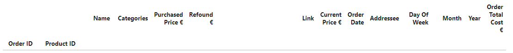
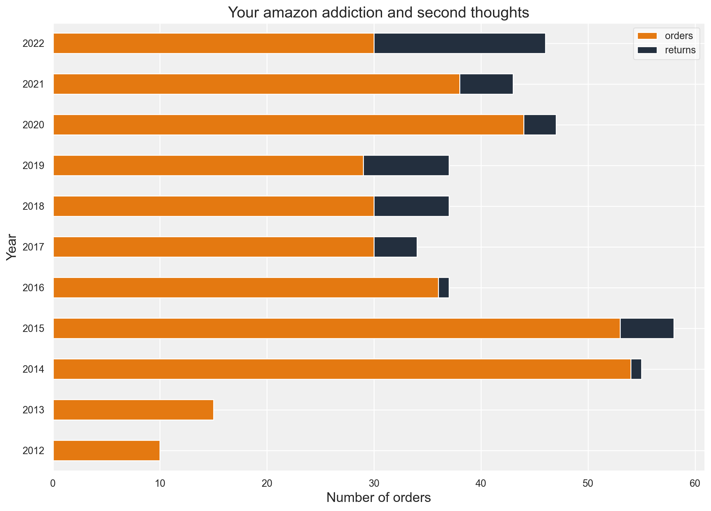
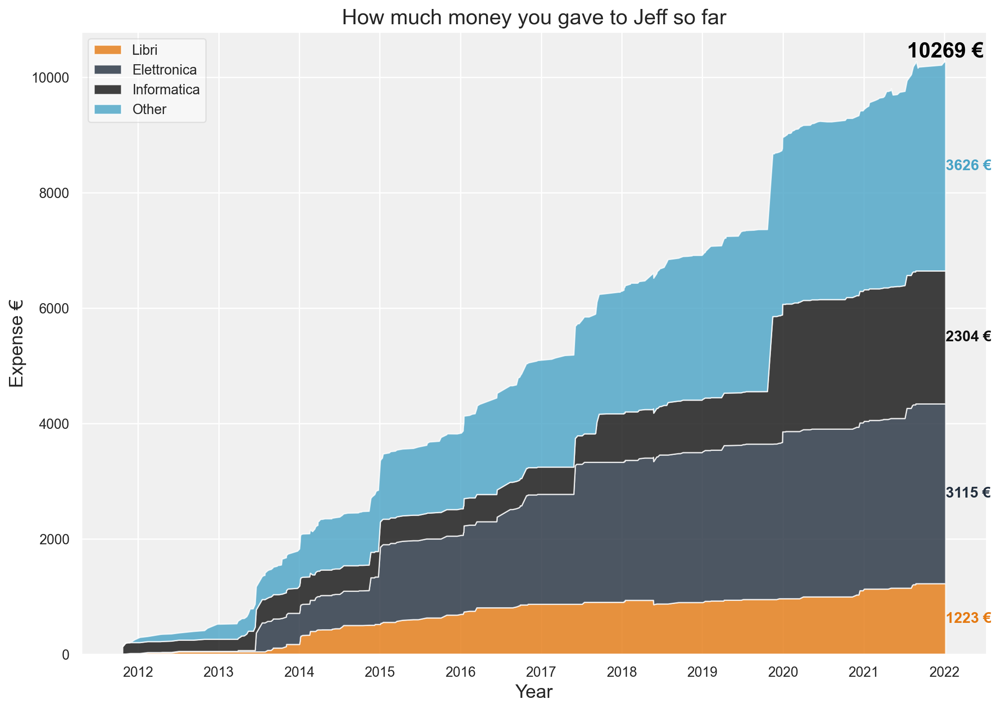

# AmazonHistory
 
If you want to know (do you? really?) how much you've spent and how on amazon.it you're in the right place! 

1. Edit the config_file with your username and password of amazon.it
2. Install the package you need
3. Run the main, it launches a chrome page and it starts scraping. It might take a while.
4. A dataframe containing your order details will be created and saved locally
   
5. Open the VisualizeAmazonHistory.ipynb jupyter notebook and run it

6. Cry
